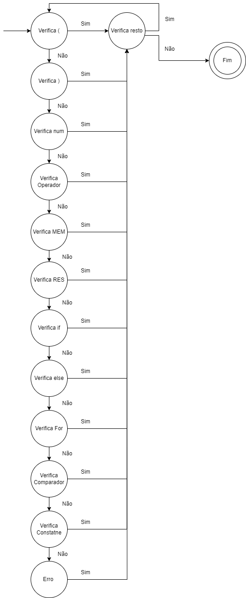
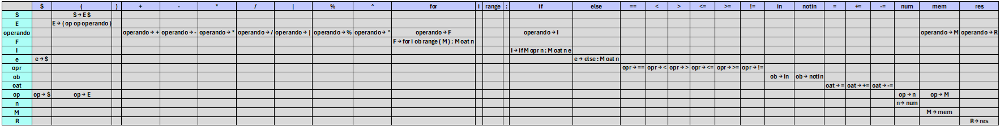

# PROJETO CALCULADORA - FASE 3
  Este é um programa em Python implementado para a realização da validação léxica e sintática das expressões contidas nos arquivos de teste disponivéis. Além de analisar os tipos de cada operando das expressões válidas, gerando um txt com as expressões, os tipos dos operandos, a regra de sequentes usada para validar estes tipos e o tipo da expressão final.

## Execução do programa
Caso só estejam disponíveis os arquivos:  
analisador.py  
formulas1.txt  
formulas2.txt  
formulas3.txt  
MEFAnalisadorLexico.png  
readme.md  
TabelaDerivacao.png  
Rode o comando: antlr4 -Dlanguage=Python3 Sintatico.g4   
Caso contrário apenas faça: 
--- Replit Shell  
python analisador.py 'formulasn'  
Onde n pode assumir os valores de: 1, 2 e 3.  

### Exemplo de um padrão válido de expressões
(8 16 -)  
(48 (16 1 -) |)  
((5 RES) MEM)  
(MEM 2 *)  
((5.8 4.2 +) (2 3 *) +)  
(4 (2 3 *) +)  
(2 RES)  
(2 (2 (2 (2 (2 2 *) *) *) *) *)  
(if MEM >= 5: MEM = 10)  
(if MEM < 3: MEM = 1 else: MEM = 5)  
(for i in range(MEM): MEM -= 10)  
(2 MEM +)  

  Ademais, as expressões válidas são separdas em tokens, os quais são utilizados para gerar uma string de tokens.
  
  Após a realização da análise léxica o programa faz a validação sintática das expressões que não apresentaram erro léxico. Para uma análise correta o analisador sintático foi desenvolvido através das regras de produção criadas e da tabela LL(1).

  Além disso, o programa gera a respectiva árvore sintática para as regras de produção criadas e validadas com FIRST e FOLLOW para LL(1).
  
## Analisador léxico com máquina de estados finitos
### - Diagrama de transição da máquina de estados finitos
 
  A máquina de estados finitos criada para o analisador léxico usa de base a estrutura de expressões válidas citada anteriormente. Sua funcionalidade consiste em:

#### 1º estado:
Verifica se o dado consiste em um parênteses aberto '('

#### 2º estado:
Verifica se o dado consiste em um parênteses fehcado ')'

#### 3º estado:
Verifica se o dado consiste em um número (int ou float)

#### 4º estado:
Verifica se o dado consiste em um operador aritmético ('+', '-', '*', '|', '/', '%', '^')

#### 5º estado:
Verifica se o dado consiste em 'MEM'

#### 6º estado:
Verifica se o dado consiste em 'RES'

#### 7º estado:
Verifica se o dado consiste em 'if'

#### 8º estado:
Verifica se o dado consiste em 'else:'

#### 9º estado:
Verifica se o dado consiste em 'for'

#### 10º estado:
Verifica se o dado consiste em comparador ('==', '<', '>', '<=', '>=', '!=' ou 'in', 'not in' ou '=', '+=', '-=', '*=', '/=', '%=', '^=', '|=')

#### 11º estado:
Verifica se o dado consiste em uma constante ('i', 'range', ':')

  A verificação é realizada de forma linear, onde a máquina verifica o estado 1, se não for válido passa para o estado 2, dessa forma, se ela chegar até o estado 11 e o mesmo também não for válido ela vai para o estado de erro apontando assim, o erro léxico. Caso a validação seja feita em algum estado, a máquina vai para o estado de resto, onde é verificado se a expressão ainda tem algo a ser analisado. Se a string chegou ao fim a máquina é finalizada, mas se a expressão é aninhada a máquina volta para as verificações novamente.

## Analisador sintático
### Regras de produção

E → (op op operando)  
operando → + OR - OR * OR / OR | OR % OR ^ OR M OR R OR F OR I   
F → for i ob range ( M ) : M oat n    
I → if M opr n : M oat n e   
e → else : M oat n | $   
opr → == OR < OR > OR <= OR >= OR !=   
ob → in OR notIn   
oat → = OR += OR -=    
op → n OR E OR M OR $    
n → num    
M → mem    
R → res    

Signicado de siglas:   
E: Expressao 
oat: Operador de atribuição 
ob: Operador de busca 
opr: Operador relacional 
num: [0..9]+ OR [0-9]+\.[0-9]+  

### Conjuntos de FIRST E FOLLOW
FIRST(S) = {(} 
FIRST(E) = {(} 
FIRST(operando) = {+, -, *, /, |, %, ^, mem, res, for, if} 
FIRST(F) = {for} 
FIRST(I) = {if} 
FIRST(e) = {else, $} 
FIRST(opr) = {==, <, >, <=, >=, !=} 
FIRST(ob) = {in, notin} 
FIRST(oat) = {=, +=, -=} 
FIRST(op) = {(, $, num, mem} 
FIRST(n) = {num} 
FIRST(M) = {mem} 
FIRST(R) = {res} 

FOLLOW(S) = {$} 
FOLLOW(E) = {+, -, *, /, |, %, ^, mem, res, for, if, (, $, num} 
FOLLOW(operando) = {)} 
FOLLOW(F) = {)} 
FOLLOW(I) = {)} 
FOLLOW(e) = {)} 
FOLLOW(opr) = {num} 
FOLLOW(ob) = {range} 
FOLLOW(oat) = {num} 
FOLLOW(op) = {+, -, *, /, |, %, ^, mem, res, for, if, (, $, num} 
FOLLOW(n) = {), else, $, :, +, -, *, /, |, %, ^, mem, res, for, if, (, num} 
FOLLOW(M) = {), =, +=, -=, ==, <, >, <=, >=, !=, +, -, *, /, |, %, ^, mem, res, for, if, (, $, num} 
FOLLOW(R) = {)} 

### Tabela de derivação
 
  Após a criação das regras de produção com o First e Follow para o LL(1) e da tabela de derivação, foi desenvolvido um analisador sintático através do ANTLR, dessa forma, o mesmo respeita a gramática criada.

  Ademais, foram feito tratamentos para preencher os espaços vazios entre parêntese com $, pois assim, o analisador sintático pode realizar a validação de forma correta.

## Analisador de tipos
### Regras de sequentes
  Regra de sequentes: tipoNumero(int or float) tipoNumero2(int or float) tipoResultado(int or float).
### Funcionamento
  Analisa os tipos dos operando. Essa análise percorren a pilha de dados a partir dos nós filhos, registrando em um arquivo txt com as expressões, os tipos dos operandos, a regra de sequentes usada para validar estes tipos e o tipo da expressão final.
### Arquivo txt com a análise de tipos
  Nome do arquivo AnaliseDeTipos.txt
  Conteúdo do arquivo:
  Expressao: ((90 5 /) (4 3 *) +)
  Regra de sequentes: tipoNumero(int or float) tipoNumero2(int or float) tipoResultado(int or float)
    -> Tipo número 90: <class 'int'> -> Tipo número 5: <class 'int'> -> Tipo resultado 18: <class 'int'>
    -> Tipo número 4: <class 'int'> -> Tipo número 3: <class 'int'> -> Tipo resultado 12: <class 'int'>
    -> Tipo número 18: <class 'int'> -> Tipo número 12: <class 'int'> -> Tipo resultado 30: <class 'int'>
    -> Tipo resposta expressao: <class 'int'> 
